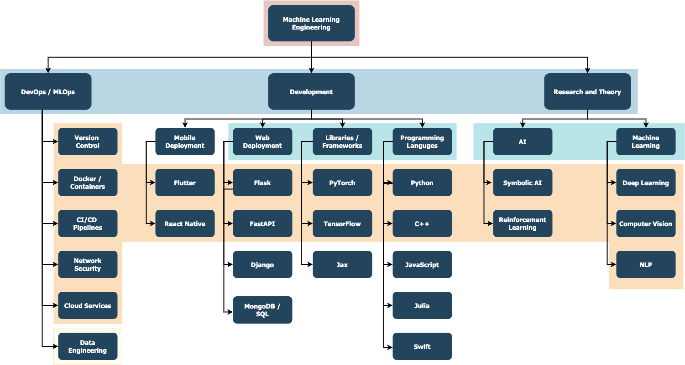

<!-- Use the vscode extensions markdownlint and Markdown All in One while contributing -->

# McCarthy-AI-Roadmap

Roadmap to learn AI for associates at McCarthy Lab@[Next Tech Lab](https://www.nexttechlab.io/)

**Note** : *This is a rough roadmap to guide you on your Machine Learning journey. We recommend everyone to focus on core CS principles and industry-standard tech stacks with a strong focus on Machine Learning theory and development. This might look overwhelming at first, but it's really not.* 🙂

> Roadmap
>

## 1. Data Science Stack

* Best places to learn -
  * [python-course.eu](https://www.python-course.eu/)
  * [datacamp.com](https://www.datacamp.com/)
  * [pythonprogramming.net](https://www.pythonprogramming.net/)
* Python
* NumPy
* Pandas
* Matplotlib and Seaborn
* scikit-learn
* SciPy

## 2. Technology Stack

* [The Missing Semester from your CS education] (https://missing.csail.mit.edu/)
* Basic computer architecture:
  * [GPU vs CPU](https://blogs.nvidia.com/blog/2009/12/16/whats-the-difference-between-a-cpu-and-a-gpu/)
  * [File Systems](https://wiki.microfocus.com/index.php/File_System_Primer)
* [Linux](https://www.digitalocean.com/community/tutorials/an-introduction-to-linux-basics)
* [Containers - Docker](https://docs.docker.com/engine/docker-overview/)
* [Bash Cheatsheet](https://devhints.io/bash)
* [Git-Introduction](https://readwrite.com/2013/09/30/understanding-github-a-journey-for-beginners-part-1/)

## 3. Deep Learning Frameworks

* [PyTorch](https://pytorch.org/tutorials/)
  * [Deep Learning with PyTorch](https://pytorch.org/assets/deep-learning/Deep-Learning-with-PyTorch.pdf) - excellent resource for learning
  * Use [fast.ai](https://docs.fast.ai/training.html) as High level wrapper (not recommended due to instability of the library and lack of adequate documentation)
* [TensorFlow](https://www.tensorflow.org/tutorials/)
  * Use [tf.keras](https://www.tensorflow.org/guide/keras) as a High level wrapper
  * [Effective TensorFlow](https://github.com/vahidk/EffectiveTensorflow)

## 4. Reinforcement Learning - Libraries

* [List of active projects](https://github.com/kengz/awesome-deep-rl#libraries)

## Mooc Resources

## Data Structures and Algorithms

* [Stanford Algorithms - Coursera](https://www.coursera.org/specializations/algorithms) or
* [Introduction to Algorithms (MIT 6.006)](https://ocw.mit.edu/courses/electrical-engineering-and-computer-science/6-006-introduction-to-algorithms-fall-2011/)
* [Introduction to Computational Thinking and Data Science (MIT 6.0002)](https://ocw.mit.edu/courses/electrical-engineering-and-computer-science/6-0002-introduction-to-computational-thinking-and-data-science-fall-2016/)
* Learn any one programming language really well and compete on Codechef, Hackerrank, HackerEarth, etc

## Machine Learning/AI MOOCs

* [Machine Learning - Coursera](https://www.coursera.org/learn/machine-learning)
* [UC Berkeley CS188](https://inst.eecs.berkeley.edu/~cs188/fa18/) or
* [MIT 6.034](https://ocw.mit.edu/courses/electrical-engineering-and-computer-science/6-034-artificial-intelligence-fall-2010/lecture-videos/)

**Note** :

* Implement Machine Learning models from scratch using Python
* Once you're comfortable implementing models from scratch, learn scikit-learn and compare performance
* Practice on Kaggle to get your skills ---> :sunglasses:

## Deep Learning MOOCs

* [TensorFlow in Practice Specialization - Coursera](https://www.coursera.org/specializations/tensorflow-in-practice?)
* [fast.ai](http://www.fast.ai/)
* [Stanford University's CS224n - NLP](https://www.youtube.com/watch?v=OQQ-W_63UgQ&list=PL3FW7Lu3i5Jsnh1rnUwq_TcylNr7EkRe6)

## Reinforcement Learning Tutorials

* [David Silver](https://www.youtube.com/watch?v=2pWv7GOvuf0&list=PL7-jPKtc4r78-wCZcQn5IqyuWhBZ8fOxT)
* [Practical Reinforcement Learning](https://www.coursera.org/learn/practical-rl)
* [Practial RL - Yandex Data School](https://github.com/yandexdataschool/Practical_RL)

## Deploying/Shipping Projects

### Feel free to use any of these frameworks, all are not required

* [Full Stack Deep Learning](https://fullstackdeeplearning.com/)
* [Full Stack Python] (https://www.fullstackpython.com/)
* [TensorFlow: Data and Deployment Specialization](https://www.coursera.org/specializations/tensorflow-data-and-deployment?)
* [Django](https://docs.djangoproject.com/en/3.0/intro/tutorial01/)
* [Flask](https://www.tutorialspoint.com/flask/index.htm)
* [Flutter](https://www.tutorialspoint.com/flutter/index.htm)
  
## Academic Courses

* [Deep Learning (with Pytorch)](https://atcold.github.io/pytorch-Deep-Learning/)
  * DS-GA 1008: Deep Learning | SPRING 2020
* [Introduction to Deep Learning](http://introtodeeplearning.com/)  
  * MIT 6.S191: Introduction to Deep Learning | 2020
* [CNNs for Visual Recognition](http://cs231n.stanford.edu)
  * CS231n: CNNs for Visual Recognition, Stanford | Spring 2019
* [NLP with Deep Learning](http://web.stanford.edu/class/cs224n/index.html#schedule)
  * CS224n: NLP with Deep Learning, Stanford | Winter 2019
* [Deep Reinforcement Learning](https://www.youtube.com/playlist?list=PLkFD6_40KJIwhWJpGazJ9VSj9CFMkb79A)
  * CS285: Deep Reinforcement Learning, UC Berkeley | Fall 2020
  * CS285: Deep Reinforcement Learning, UC Berkeley | Fall 2019
* [Unsupervised Learning](https://www.youtube.com/playlist?list=PLwRJQ4m4UJjPiJP3691u-qWwPGVKzSlNP)
  * CS294-158-SP20: Deep Unsupervised Learning, UC Berkeley | Spring 2020
* [Multi-Task and Meta Learning](https://www.youtube.com/playlist?list=PLoROMvodv4rMC6zfYmnD7UG3LVvwaITY5)
  * Stanford CS330: Multi-Task and Meta-Learning | 2019

## Books and Further reading material

## Machine Learning Books for reference

* [Introduction to Statstical Learning](https://www-bcf.usc.edu/~gareth/ISL/)
* [Elements of Statistical Learning](https://web.stanford.edu/~hastie/Papers/ESLII.pdf) (A little more in-depth than ISLR)
* [Pattern Recognition And Machine Learning](http://users.isr.ist.utl.pt/~wurmd/Livros/school/Bishop%20-%20Pattern%20Recognition%20And%20Machine%20Learning%20-%20Springer%20%202006.pdf)

**Note** : Learn from official tutorials/docs or GitHub repos which have detailed notebooks like [Grokking Deep Learning](https://github.com/iamtrask/Grokking-Deep-Learning) or [PyTorch Examples](https://github.com/pytorch/examples)

## Deep Learning Books

* [Neural Networks and Deep Learning](http://neuralnetworksanddeeplearning.com/)
* [Deep Learning Book](http://www.deeplearningbook.org/)

## Mathematics for Machine Learning

* [The Matrix Calculus You Need For Deep Learning - - Quick refresher](https://arxiv.org/pdf/1802.01528)
* [Mathematics for Machine Learning - Intermediate](https://mml-book.github.io/)
* [Numerical Algorithms - Advanced](https://people.csail.mit.edu/jsolomon/share/book/numerical_book.pdf)

## Natural Language Processing

* [Natural Language Processing by National Research University Higher School of Economics](https://www.coursera.org/learn/language-processing)
* [NLP course by Yandex Data School](https://github.com/yandexdataschool/nlp_course)

## Reinforcement Learning Books

* [Reinforcement Learning – An Introduction](https://drive.google.com/file/d/1opPSz5AZ_kVa1uWOdOiveNiBFiEOHjkG/view)
* [Spinning Up RL](https://spinningup.openai.com/en/latest/) (Blog)

## Read blogs, Reddit, follow researchers on Twitter

* [Towards Data Science](https://towardsdatascience.com/)
* [Sebastian Ruder](http://ruder.io/)
* [montreal.ai](https://montrealartificialintelligence.com/)
* [thegradient](https://thegradient.pub/)
* [Reddit - Machine Learning](https://www.reddit.com/r/MachineLearning/)
* [Reddit - Deep Learning](https://www.reddit.com/r/deeplearning/)
* [https://github.com/ujjwalkarn/Machine-Learning-Tutorials](https://github.com/ujjwalkarn/Machine-Learning-Tutorials)

## Podcasts to Follow Interesting Developments In The Field

* [TWIML AI Podcast](https://twimlai.com/tag/podcast/)
* [The Data Skeptic](https://open.spotify.com/show/1BZN7H3ikovSejhwQTzNm4?si=gv3IrtPzQs6F9phaHDGpSQ)
* [The AI Podcast - Nvidia](https://soundcloud.com/theaipodcast)
* [Artificial Intelligence with Lex Fridman, MIT AI](https://open.spotify.com/show/2MAi0BvDc6GTFvKFPXnkCL)
* [Linear Digressions](http://lineardigressions.com/)
* [Yannic Kilcher](https://www.youtube.com/channel/UCZHmQk67mSJgfCCTn7xBfew)

**Feel free to make Pull Requests stating why that particular resource should be added.**
